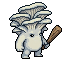
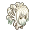
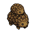
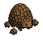
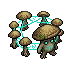

# The Mycelium — Faction Balance Sheet

A mushroom faction for [Battle for Wesnoth](https://wesnoth.org) focused on status effects, terrain control, and AoE synergies.

**Alignment:** Mostly Chaotic | **Terrain:** Mushroom Grove (self-spreading) | **Playstyle:** Debuff + outlast + terrain control

## Advancement Tree

```
                    ┌─ Oyster Knight (L2, tank) ──── King Oyster (L3, super tank)
  Oyster Squire ────┤
                    └─ Oyster Vizier (L2, slow) ──── Oyster Chamberlain (L3, slow AOE)

                    ┌─ Stinking Dapperling (L2, poison AOE) ── Deadly Dapperling (L3, marksman AOE)
  Deathcap ─────────┤
                    └─ Inkcap (L2, toxic strike) ─────────────── Nightcap (L3, assassin)

                    ┌─ Shaggy Mane (L2, cures) ── Lawyer's Wig (L3, AOE heal + regen)
  Lion's Mane ──────┤
                    └─ Bear's Head (L2, blight) ── Bleeding Tooth (L3, blight AOE)

                    ┌─ Double Truffle (L2, overgrowth) ── Trufflemaker (L3, fast bruiser)
  Truffle ──────────┤
                    └─ Portalbello (L2, teleport) ──────── Fairy Ring (L3, teleport raider)

                    ┌─ Earth Star (L2, electric AOE) ── Milky Way (L3, electric apex)
  Glowcap ──────────┤
                    └─ Black Hole (L2, arcane) ──────────── Cosmic Shroom (L3, arcane apex)

                    ┌─ Morel Dilemma (L2, plague aura) ── False Morel (L3, puffball plague)
  Morel ────────────┤
                    └─ Morel Support (L2, drain aura) ─── Morel Authority (L3, leadership + drain)

                    ┌─ Mad Prince (L2, terror) ── Mad Lord (L3, terror + plague)
  Madcap ───────────┤
                    └─ Fungi (L2, leadership) ──── Fun Grandpa (L3, leadership + regen)

  Spore (L0) ────── Puffball (L1, skirmisher)      [spawned, not recruitable]
```

## Core Mechanics

- **Fungal Spread:** Every Mycelium unit converts its hex to Mushroom Grove at turn start
- **Grove-Bound:** Some attacks only work while standing on a Mushroom Grove (consumed on use)
- **Death Bloom:** Spores/Puffballs convert nearby hexes to groves and poison adjacent enemies on death
- **Fungal Plague:** Certain units spawn Spores from killed enemies

---

## Oyster Line

---

### Oyster Squire



| | |
|---|---|
| **Level** | 1 |
| **HP** | 38 |
| **Cost** | 15 |
| **XP** | 40 |
| **Alignment** | Chaotic |
| **Usage** | Fighter |
| **Advances To** | [Oyster Vizier](#oyster-vizier), [Oyster Knight](#oyster-knight) |
| **Advances From** | — |
| **Abilities** | — |

| Attack | Type | Range | Dmg × Hits | Total | Specials |
|--------|------|-------|------------|------:|----------|
| Club | impact | melee | 6×2 | 12 | Slow |
| Spore Puff | impact | ranged | 3×2 | 6 | — |

<details>
<summary>Resistances & Terrain</summary>

| Resistance | Value |
|------------|------:|
| Fire | 0% (immune) |
| Arcane | 0% (immune) |

| Terrain | Defense |
|---------|-------:|
| **Fungus** | **40%** |

</details>

---

### Oyster Knight


| | |
|---|---|
| **Level** | 2 |
| **HP** | 59 |
| **Cost** | 32 |
| **XP** | 88 |
| **Alignment** | Neutral |
| **Usage** | Fighter |
| **Advances To** | [King Oyster](#king-oyster) |
| **Advances From** | [Oyster Squire](#oyster-squire) |
| **Abilities** | Steadfast |

| Attack | Type | Range | Dmg × Hits | Total | Specials |
|--------|------|-------|------------|------:|----------|
| Club | impact | melee | 8×3 | 24 | — |
| Spore Puff | impact | ranged | 9×1 | 9 | — |

<details>
<summary>Resistances & Terrain</summary>

| Resistance | Value |
|------------|------:|
| Blade | 30% |
| Pierce | 30% |
| Impact | 20% |
| Fire | 0% (immune) |
| Arcane | 0% (immune) |

| Terrain | Defense |
|---------|-------:|
| **Fungus** | **40%** |

</details>

---

### Oyster Vizier


| | |
|---|---|
| **Level** | 2 |
| **HP** | 52 |
| **Cost** | 32 |
| **XP** | 88 |
| **Alignment** | Chaotic |
| **Usage** | Fighter |
| **Advances To** | [Oyster Chamberlain](#oyster-chamberlain) |
| **Advances From** | [Oyster Squire](#oyster-squire) |
| **Abilities** | — |

| Attack | Type | Range | Dmg × Hits | Total | Specials |
|--------|------|-------|------------|------:|----------|
| Club | impact | melee | 9×3 | 27 | Slow |
| Spore Puff | impact | ranged | 6×2 | 12 | Slow |
| Spore Eruption | impact | ranged | 6×2 | 12 | Slow, AOE, Grove-Bound |

<details>
<summary>Resistances & Terrain</summary>

| Resistance | Value |
|------------|------:|
| Fire | 0% (immune) |
| Arcane | 0% (immune) |

| Terrain | Defense |
|---------|-------:|
| **Fungus** | **40%** |

</details>

---

### King Oyster


| | |
|---|---|
| **Level** | 3 |
| **HP** | 68 |
| **Cost** | 63 |
| **Alignment** | Neutral |
| **Usage** | Fighter |
| **Advances To** | — |
| **Advances From** | [Oyster Knight](#oyster-knight) |
| **Abilities** | Steadfast |

| Attack | Type | Range | Dmg × Hits | Total | Specials |
|--------|------|-------|------------|------:|----------|
| Club | impact | melee | 10×3 | 30 | — |
| Spore Puff | impact | ranged | 12×1 | 12 | — |

<details>
<summary>Resistances & Terrain</summary>

| Resistance | Value |
|------------|------:|
| Blade | 30% |
| Pierce | 30% |
| Impact | 20% |
| Fire | 10% |
| Arcane | 10% |

| Terrain | Defense |
|---------|-------:|
| **Fungus** | **40%** |

</details>

---

### Oyster Chamberlain


| | |
|---|---|
| **Level** | 3 |
| **HP** | 62 |
| **Cost** | 52 |
| **Alignment** | Chaotic |
| **Usage** | Fighter |
| **Advances To** | — |
| **Advances From** | [Oyster Vizier](#oyster-vizier) |
| **Abilities** | — |

| Attack | Type | Range | Dmg × Hits | Total | Specials |
|--------|------|-------|------------|------:|----------|
| Club | impact | melee | 11×3 | 33 | Slow |
| Spore Puff | impact | ranged | 8×2 | 16 | Slow |
| Spore Eruption | impact | ranged | 12×2 | 24 | Slow, AOE, Grove-Bound |

<details>
<summary>Resistances & Terrain</summary>

| Resistance | Value |
|------------|------:|
| Fire | 0% (immune) |
| Arcane | 0% (immune) |

| Terrain | Defense |
|---------|-------:|
| **Fungus** | **40%** |

</details>

---

## Deathcap Line

---

### Deathcap


| | |
|---|---|
| **Level** | 1 |
| **HP** | 24 |
| **Cost** | 15 |
| **XP** | 24 |
| **Alignment** | Chaotic |
| **Usage** | Archer |
| **Advances To** | [Stinking Dapperling](#stinking-dapperling), [Inkcap](#inkcap) |
| **Advances From** | — |
| **Abilities** | — |

| Attack | Type | Range | Dmg × Hits | Total | Specials |
|--------|------|-------|------------|------:|----------|
| Toxic Touch | blade | melee | 3×2 | 6 | Poison |
| Poison Dart | pierce | ranged | 5×3 | 15 | Poison |

---

### Stinking Dapperling


| | |
|---|---|
| **Level** | 2 |
| **HP** | 36 |
| **Cost** | 32 |
| **XP** | 100 |
| **Alignment** | Chaotic |
| **Usage** | Archer |
| **Advances To** | [Deadly Dapperling](#deadly-dapperling) |
| **Advances From** | [Deathcap](#deathcap) |
| **Abilities** | — |

| Attack | Type | Range | Dmg × Hits | Total | Specials |
|--------|------|-------|------------|------:|----------|
| Toxic Touch | blade | melee | 6×2 | 12 | Poison |
| Poison Dart | pierce | ranged | 7×2 | 14 | Poison |
| Poison Cloud | impact | ranged | 5×3 | 15 | Poison, AOE, Grove-Bound |

---

### Inkcap


| | |
|---|---|
| **Level** | 2 |
| **HP** | 40 |
| **Cost** | 30 |
| **XP** | 48 |
| **Alignment** | Chaotic |
| **Usage** | Archer |
| **Advances To** | [Nightcap](#nightcap) |
| **Advances From** | [Deathcap](#deathcap) |
| **Abilities** | — |

| Attack | Type | Range | Dmg × Hits | Total | Specials |
|--------|------|-------|------------|------:|----------|
| Toxic Touch | blade | melee | 4×2 | 8 | Poison |
| Catalyst Spore | pierce | ranged | 6×3 | 18 | Toxic Strike (2× vs poisoned) |

---

### Deadly Dapperling


| | |
|---|---|
| **Level** | 3 |
| **HP** | 46 |
| **Cost** | 48 |
| **Alignment** | Chaotic |
| **Usage** | Archer |
| **Advances To** | — |
| **Advances From** | [Stinking Dapperling](#stinking-dapperling) |
| **Abilities** | — |

| Attack | Type | Range | Dmg × Hits | Total | Specials |
|--------|------|-------|------------|------:|----------|
| Toxic Touch | blade | melee | 8×3 | 24 | Poison |
| Poison Dart | pierce | ranged | 9×2 | 18 | Poison |
| Poison Cloud | impact | ranged | 7×3 | 21 | Poison, Marksman, AOE, Grove-Bound |

---

### Nightcap


| | |
|---|---|
| **Level** | 3 |
| **HP** | 51 |
| **Cost** | 46 |
| **Alignment** | Chaotic |
| **Usage** | Archer |
| **Advances To** | — |
| **Advances From** | [Inkcap](#inkcap) |
| **Abilities** | — |

| Attack | Type | Range | Dmg × Hits | Total | Specials |
|--------|------|-------|------------|------:|----------|
| Toxic Touch | blade | melee | 5×3 | 15 | Poison |
| Catalyst Spore | pierce | ranged | 8×3 | 24 | Marksman, Toxic Strike (2× vs poisoned) |

> Effective ranged damage vs poisoned targets: **48**

---

## Lion's Mane Line

---

### Lion's Mane


| | |
|---|---|
| **Level** | 1 |
| **HP** | 26 |
| **Cost** | 14 |
| **XP** | 28 |
| **Alignment** | Neutral |
| **Usage** | Healer |
| **Advances To** | [Shaggy Mane](#shaggy-mane), [Bear's Head](#bears-head) |
| **Advances From** | — |
| **Abilities** | Heals (+4) |

| Attack | Type | Range | Dmg × Hits | Total | Specials |
|--------|------|-------|------------|------:|----------|
| Staff | impact | melee | 3×2 | 6 | — |
| Spore Puff | impact | ranged | 4×2 | 8 | Slow |

---

### Shaggy Mane


| | |
|---|---|
| **Level** | 2 |
| **HP** | 38 |
| **Cost** | 30 |
| **XP** | 100 |
| **Alignment** | Neutral |
| **Usage** | Healer |
| **Advances To** | [Lawyer's Wig](#lawyers-wig) |
| **Advances From** | [Lion's Mane](#lions-mane) |
| **Abilities** | Cures |

| Attack | Type | Range | Dmg × Hits | Total | Specials |
|--------|------|-------|------------|------:|----------|
| Staff | impact | melee | 5×3 | 15 | — |
| Spore Puff | impact | ranged | 5×3 | 15 | — |

---

### Bear's Head




| | |
|---|---|
| **Level** | 2 |
| **HP** | 32 |
| **Cost** | 30 |
| **XP** | 100 |
| **Alignment** | Chaotic |
| **Usage** | Fighter |
| **Advances To** | [Bleeding Tooth](#bleeding-tooth) |
| **Advances From** | [Lion's Mane](#lions-mane) |
| **Abilities** | — |

| Attack | Type | Range | Dmg × Hits | Total | Specials |
|--------|------|-------|------------|------:|----------|
| Staff | impact | melee | 5×3 | 15 | — |
| Blight Spore | impact | ranged | 4×3 | 12 | Blight |
| Blighting Spores | impact | ranged | 6×3 | 18 | Blight, AOE, Grove-Bound |

---

### Lawyer's Wig


| | |
|---|---|
| **Level** | 3 |
| **HP** | 48 |
| **Cost** | 44 |
| **Alignment** | Neutral |
| **Usage** | Healer |
| **Advances To** | — |
| **Advances From** | [Shaggy Mane](#shaggy-mane) |
| **Abilities** | Cures, Regenerates, AOE Heal (+8) |

| Attack | Type | Range | Dmg × Hits | Total | Specials |
|--------|------|-------|------------|------:|----------|
| Staff | impact | melee | 7×3 | 21 | — |
| Spore Puff | impact | ranged | 7×3 | 21 | — |

---

### Bleeding Tooth


| | |
|---|---|
| **Level** | 3 |
| **HP** | 44 |
| **Cost** | 46 |
| **Alignment** | Chaotic |
| **Usage** | Fighter |
| **Advances To** | — |
| **Advances From** | [Bear's Head](#bears-head) |
| **Abilities** | — |

| Attack | Type | Range | Dmg × Hits | Total | Specials |
|--------|------|-------|------------|------:|----------|
| Staff | impact | melee | 7×3 | 21 | Blight |
| Blight Spore | impact | ranged | 6×3 | 18 | Blight |
| Blighting Spores | impact | ranged | 9×3 | 27 | Blight, AOE, Grove-Bound |

---

## Truffle Line

---

### Truffle


| | |
|---|---|
| **Level** | 1 |
| **HP** | 26 |
| **Cost** | 14 |
| **XP** | 32 |
| **Alignment** | Chaotic |
| **Usage** | Scout |
| **Advances To** | [Double Truffle](#double-truffle), [Portalbello](#portalbello) |
| **Advances From** | — |
| **Abilities** | Ambush |

| Attack | Type | Range | Dmg × Hits | Total | Specials |
|--------|------|-------|------------|------:|----------|
| Tendril Lash | blade | melee | 5×3 | 15 | — |

---

### Double Truffle




| | |
|---|---|
| **Level** | 2 |
| **HP** | 38 |
| **Cost** | 30 |
| **XP** | 55 |
| **Alignment** | Chaotic |
| **Usage** | Scout |
| **Advances To** | [Trufflemaker](#trufflemaker) |
| **Advances From** | [Truffle](#truffle) |
| **Abilities** | Ambush, Overgrowth |

| Attack | Type | Range | Dmg × Hits | Total | Specials |
|--------|------|-------|------------|------:|----------|
| Tendril Lash | blade | melee | 7×4 | 28 | — |
| Entangle | impact | melee | 5×2 | 10 | Slow |

---

### Portalbello


| | |
|---|---|
| **Level** | 2 |
| **HP** | 38 |
| **Cost** | 30 |
| **XP** | 55 |
| **Alignment** | Chaotic |
| **Usage** | Scout |
| **Advances To** | [Fairy Ring](#fairy-ring) |
| **Advances From** | [Truffle](#truffle) |
| **Abilities** | Disengage, Fungal Tunnel (teleport between groves) |

| Attack | Type | Range | Dmg × Hits | Total | Specials |
|--------|------|-------|------------|------:|----------|
| Tendril Lash | blade | melee | 7×3 | 21 | — |
| Entangle | impact | melee | 5×2 | 10 | Slow |

---

### Trufflemaker




| | |
|---|---|
| **Level** | 3 |
| **HP** | 58 |
| **Cost** | 46 |
| **Alignment** | Chaotic |
| **Usage** | Scout |
| **Advances To** | — |
| **Advances From** | [Double Truffle](#double-truffle) |
| **Abilities** | Ambush, Overgrowth |

| Attack | Type | Range | Dmg × Hits | Total | Specials |
|--------|------|-------|------------|------:|----------|
| Tendril Lash | blade | melee | 10×4 | 40 | — |
| Entangle | impact | melee | 8×2 | 16 | Slow |

---

### Fairy Ring




| | |
|---|---|
| **Level** | 3 |
| **HP** | 54 |
| **Cost** | 46 |
| **Alignment** | Chaotic |
| **Usage** | Scout |
| **Advances To** | — |
| **Advances From** | [Portalbello](#portalbello) |
| **Abilities** | Disengage, Mycelial Network (teleport between groves) |

| Attack | Type | Range | Dmg × Hits | Total | Specials |
|--------|------|-------|------------|------:|----------|
| Tendril Lash | blade | melee | 9×4 | 36 | — |
| Entangle | impact | melee | 7×2 | 14 | Slow |

---

## Glowcap Line

---

### Glowcap


| | |
|---|---|
| **Level** | 1 |
| **HP** | 26 |
| **Cost** | 16 |
| **XP** | 44 |
| **Alignment** | Neutral |
| **Usage** | Archer |
| **Advances To** | [Earth Star](#earth-star), [Black Hole](#black-hole) |
| **Advances From** | — |
| **Abilities** | — |

| Attack | Type | Range | Dmg × Hits | Total | Specials |
|--------|------|-------|------------|------:|----------|
| Spark Bolt | electric | ranged | 9×2 | 18 | Magical |

---

### Earth Star


| | |
|---|---|
| **Level** | 2 |
| **HP** | 40 |
| **Cost** | 34 |
| **XP** | 75 |
| **Alignment** | Neutral |
| **Usage** | Archer |
| **Advances To** | [Milky Way](#milky-way) |
| **Advances From** | [Glowcap](#glowcap) |
| **Abilities** | — |

| Attack | Type | Range | Dmg × Hits | Total | Specials |
|--------|------|-------|------------|------:|----------|
| Shock Touch | electric | melee | 5×2 | 10 | — |
| Spark Bolt | electric | ranged | 10×3 | 30 | Magical |
| Lightning Storm | electric | ranged | 10×3 | 30 | Magical, AOE, Grove-Bound |

---

### Black Hole


| | |
|---|---|
| **Level** | 2 |
| **HP** | 36 |
| **Cost** | 34 |
| **XP** | 100 |
| **Alignment** | Chaotic |
| **Usage** | Archer |
| **Advances To** | [Cosmic Shroom](#cosmic-shroom) |
| **Advances From** | [Glowcap](#glowcap) |
| **Abilities** | Obscure, Feeding |

| Attack | Type | Range | Dmg × Hits | Total | Specials |
|--------|------|-------|------------|------:|----------|
| Void Touch | arcane | melee | 5×2 | 10 | — |
| Void Bolt | arcane | ranged | 9×3 | 27 | Magical |

---

### Milky Way


| | |
|---|---|
| **Level** | 3 |
| **HP** | 48 |
| **Cost** | 50 |
| **Alignment** | Neutral |
| **Usage** | Archer |
| **Advances To** | — |
| **Advances From** | [Earth Star](#earth-star) |
| **Abilities** | — |

| Attack | Type | Range | Dmg × Hits | Total | Specials |
|--------|------|-------|------------|------:|----------|
| Shock Touch | electric | melee | 7×3 | 21 | — |
| Spark Bolt | electric | ranged | 12×3 | 36 | Magical |
| Lightning Storm | electric | ranged | 14×3 | 42 | Magical, AOE, Grove-Bound |

---

### Cosmic Shroom


| | |
|---|---|
| **Level** | 3 |
| **HP** | 44 |
| **Cost** | 50 |
| **Alignment** | Chaotic |
| **Usage** | Archer |
| **Advances To** | — |
| **Advances From** | [Black Hole](#black-hole) |
| **Abilities** | Obscure, Feeding |

| Attack | Type | Range | Dmg × Hits | Total | Specials |
|--------|------|-------|------------|------:|----------|
| Void Touch | arcane | melee | 7×3 | 21 | — |
| Void Bolt | arcane | ranged | 12×3 | 36 | Magical |

---

## Morel Line

---

### Morel


| | |
|---|---|
| **Level** | 1 |
| **HP** | 28 |
| **Cost** | 14 |
| **XP** | 32 |
| **Alignment** | Chaotic |
| **Usage** | Mixed Fighter |
| **Advances To** | [Morel Dilemma](#morel-dilemma), [Morel Support](#morel-support) |
| **Advances From** | — |
| **Abilities** | — |

| Attack | Type | Range | Dmg × Hits | Total | Specials |
|--------|------|-------|------------|------:|----------|
| Parasitic Touch | blade | melee | 5×2 | 10 | Drain |
| Mind Spore | arcane | ranged | 4×2 | 8 | — |

---

### Morel Dilemma


| | |
|---|---|
| **Level** | 2 |
| **HP** | 45 |
| **Cost** | 34 |
| **XP** | 75 |
| **Alignment** | Chaotic |
| **Usage** | Mixed Fighter |
| **Advances To** | [False Morel](#false-morel) |
| **Advances From** | [Morel](#morel) |
| **Abilities** | Fungal Brood (adjacent allies' kills spawn Spores) |

| Attack | Type | Range | Dmg × Hits | Total | Specials |
|--------|------|-------|------------|------:|----------|
| Parasitic Touch | blade | melee | 6×3 | 18 | Drain |
| Domination Spore | arcane | ranged | 5×4 | 20 | Fungal Plague |

---

### Morel Support


| | |
|---|---|
| **Level** | 2 |
| **HP** | 43 |
| **Cost** | 32 |
| **XP** | 75 |
| **Alignment** | Chaotic |
| **Usage** | Mixed Fighter |
| **Advances To** | [Morel Authority](#morel-authority) |
| **Advances From** | [Morel](#morel) |
| **Abilities** | Parasitic Link (adjacent allies' attacks drain HP) |

| Attack | Type | Range | Dmg × Hits | Total | Specials |
|--------|------|-------|------------|------:|----------|
| Parasitic Touch | blade | melee | 6×3 | 18 | Drain |
| Mind Spore | arcane | ranged | 5×3 | 15 | — |

---

### False Morel


| | |
|---|---|
| **Level** | 3 |
| **HP** | 55 |
| **Cost** | 52 |
| **Alignment** | Chaotic |
| **Usage** | Mixed Fighter |
| **Advances To** | — |
| **Advances From** | [Morel Dilemma](#morel-dilemma) |
| **Abilities** | Enhanced Fungal Brood (adjacent allies' kills spawn Puffballs) |

| Attack | Type | Range | Dmg × Hits | Total | Specials |
|--------|------|-------|------------|------:|----------|
| Parasitic Touch | blade | melee | 7×3 | 21 | Drain |
| Domination Spore | arcane | ranged | 7×4 | 28 | Fungal Plague |

---

### Morel Authority


| | |
|---|---|
| **Level** | 3 |
| **HP** | 55 |
| **Cost** | 50 |
| **Alignment** | Chaotic |
| **Usage** | Mixed Fighter |
| **Advances To** | — |
| **Advances From** | [Morel Support](#morel-support) |
| **Abilities** | Leadership, Parasitic Link (adjacent allies' attacks drain HP) |

| Attack | Type | Range | Dmg × Hits | Total | Specials |
|--------|------|-------|------------|------:|----------|
| Parasitic Touch | blade | melee | 7×3 | 21 | Drain |
| Mind Spore | arcane | ranged | 7×3 | 21 | — |

---

## Madcap Line

---

### Madcap


*Dwarf berserker — does not spread groves passively*

| | |
|---|---|
| **Level** | 1 |
| **HP** | 34 |
| **Cost** | 19 |
| **XP** | 40 |
| **Alignment** | Chaotic |
| **Usage** | Fighter |
| **Advances To** | [Mad Prince](#mad-prince), [Fungi](#fungi) |
| **Advances From** | — |
| **Abilities** | — |

| Attack | Type | Range | Dmg × Hits | Total | Specials |
|--------|------|-------|------------|------:|----------|
| Hand Axe | blade | melee | 4×4 | 16 | — |
| Mushroom Frenzy | blade | melee | 4×4 | 16 | Berserk, Grove-Bound |

<details>
<summary>Terrain Defense</summary>

| Terrain | Defense |
|---------|-------:|
| **Fungus** | **40%** |
| Village | 60% |

</details>

---

### Mad Prince


*Dwarf berserker*

| | |
|---|---|
| **Level** | 2 |
| **HP** | 44 |
| **Cost** | 28 |
| **XP** | 76 |
| **Alignment** | Chaotic |
| **Usage** | Fighter |
| **Advances To** | [Mad Lord](#mad-lord) |
| **Advances From** | [Madcap](#madcap) |
| **Abilities** | Terror |

| Attack | Type | Range | Dmg × Hits | Total | Specials |
|--------|------|-------|------------|------:|----------|
| Hand Axe | blade | melee | 7×4 | 28 | — |
| Mushroom Frenzy | blade | melee | 7×4 | 28 | Berserk, Grove-Bound |

<details>
<summary>Terrain Defense</summary>

| Terrain | Defense |
|---------|-------:|
| **Fungus** | **40%** |
| Village | 60% |

</details>

---

### Fungi


*Dwarf leader*

| | |
|---|---|
| **Level** | 2 |
| **HP** | 44 |
| **Cost** | 28 |
| **XP** | 76 |
| **Alignment** | Neutral |
| **Usage** | Fighter |
| **Advances To** | [Fun Grandpa](#fun-grandpa) |
| **Advances From** | [Madcap](#madcap) |
| **Abilities** | Leadership |

| Attack | Type | Range | Dmg × Hits | Total | Specials |
|--------|------|-------|------------|------:|----------|
| Hand Axe | blade | melee | 6×4 | 24 | — |
| Mushroom Frenzy | blade | melee | 6×4 | 24 | Berserk, Grove-Bound |
| Spore Toss | impact | ranged | 4×3 | 12 | — |

<details>
<summary>Terrain Defense</summary>

| Terrain | Defense |
|---------|-------:|
| **Fungus** | **40%** |
| Village | 60% |

</details>

---

### Mad Lord


*Dwarf berserker*

| | |
|---|---|
| **Level** | 3 |
| **HP** | 60 |
| **Cost** | 46 |
| **Alignment** | Chaotic |
| **Usage** | Fighter |
| **Advances To** | — |
| **Advances From** | [Mad Prince](#mad-prince) |
| **Abilities** | Terror |

| Attack | Type | Range | Dmg × Hits | Total | Specials |
|--------|------|-------|------------|------:|----------|
| Hand Axe | blade | melee | 9×4 | 36 | Fungal Plague |
| Mushroom Frenzy | blade | melee | 9×4 | 36 | Berserk, Grove-Bound, Fungal Plague |

<details>
<summary>Terrain Defense</summary>

| Terrain | Defense |
|---------|-------:|
| **Fungus** | **40%** |
| Village | 60% |

</details>

---

### Fun Grandpa


*Dwarf leader*

| | |
|---|---|
| **Level** | 3 |
| **HP** | 60 |
| **Cost** | 46 |
| **Alignment** | Neutral |
| **Usage** | Fighter |
| **Advances To** | — |
| **Advances From** | [Fungi](#fungi) |
| **Abilities** | Leadership, Regenerates |

| Attack | Type | Range | Dmg × Hits | Total | Specials |
|--------|------|-------|------------|------:|----------|
| Hand Axe | blade | melee | 8×4 | 32 | — |
| Mushroom Frenzy | blade | melee | 8×4 | 32 | Berserk, Grove-Bound |
| Spore Toss | impact | ranged | 6×3 | 18 | — |

<details>
<summary>Terrain Defense</summary>

| Terrain | Defense |
|---------|-------:|
| **Fungus** | **40%** |
| Village | 60% |

</details>

---

## Spore Line

---

### Spore


| | |
|---|---|
| **Level** | 0 |
| **HP** | 18 |
| **Cost** | 8 |
| **Alignment** | Neutral |
| **Usage** | Fighter |
| **Advances To** | [Puffball](#puffball) |
| **Advances From** | — |
| **Abilities** | Skirmisher, Death Bloom |

> Flies. Spawned by plague/grove events — not recruitable.

| Attack | Type | Range | Dmg × Hits | Total | Specials |
|--------|------|-------|------------|------:|----------|
| Fungal Fist | impact | melee | 4×2 | 8 | Fungal Plague |

<details>
<summary>Terrain Defense</summary>

| Terrain | Defense |
|---------|-------:|
| Shallow Water | 50% |
| Reef | 50% |
| Swamp | 50% |
| Flat | 50% |
| Sand | 50% |
| Forest | 50% |
| Hills | 50% |
| Mountains | 50% |
| Village | 50% |
| Castle | 50% |
| Cave | 50% |
| Frozen | 50% |
| **Fungus** | **40%** |

*Flies over all terrain (1 MP each).*

</details>

---

### Puffball


*Upgraded Spore — does not advance further (AMLA)*

| | |
|---|---|
| **Level** | 1 |
| **HP** | 22 |
| **Cost** | 11 |
| **Alignment** | Neutral |
| **Usage** | Fighter |
| **Advances To** | — (AMLA) |
| **Advances From** | [Spore](#spore) |
| **Abilities** | Skirmisher, Death Bloom |

> Flies. Spawned from Spore advancement.

| Attack | Type | Range | Dmg × Hits | Total | Specials |
|--------|------|-------|------------|------:|----------|
| Bump | impact | melee | 4×3 | 12 | Fungal Plague |

<details>
<summary>Terrain Defense</summary>

| Terrain | Defense |
|---------|-------:|
| Shallow Water | 50% |
| Reef | 50% |
| Swamp | 50% |
| Flat | 50% |
| Sand | 50% |
| Forest | 50% |
| Hills | 50% |
| Mountains | 50% |
| Village | 50% |
| Castle | 50% |
| Cave | 50% |
| Frozen | 50% |
| **Fungus** | **40%** |

*Flies over all terrain (1 MP each).*

</details>

## Ability Glossary

| Ability | Units | Effect |
|---------|-------|--------|
| **Heals** | Lion's Mane | Heals adjacent allies +4 HP/turn |
| **Cures** | Shaggy Mane, Lawyer's Wig | Heals adjacent allies +8 HP/turn, cures poison |
| **AOE Heal** | Lawyer's Wig | Heals adjacent allies +8 HP/turn, cures poison (area) |
| **Regenerates** | Lawyer's Wig, Fun Grandpa | Recovers 8 HP/turn |
| **Steadfast** | Oyster Knight, King Oyster | Halves excess damage when not moving |
| **Leadership** | Fungi, Fun Grandpa, Morel Authority | +25% damage to adjacent lower-level allies |
| **Terror** | Mad Prince, Mad Lord | −15% damage to adjacent enemies |
| **Ambush** | Truffle, Double Truffle, Trufflemaker | Hidden in forest/cave terrain |
| **Skirmisher** | Spore, Puffball | Ignores zones of control |
| **Death Bloom** | Spore, Puffball | On death: converts nearby hexes to grove, poisons adjacent enemies |
| **Overgrowth** | Double Truffle, Trufflemaker | Spreads groves to all adjacent hexes each turn |
| **Disengage** | Portalbello, Fairy Ring | Retains 1 movement point after attacking |
| **Fungal Tunnel** | Portalbello | Teleport between Mushroom Grove tiles |
| **Mycelial Network** | Fairy Ring | Teleport between Mushroom Grove tiles |
| **Parasitic Link** | Morel Support, Morel Authority | Adjacent allies' attacks drain HP |
| **Fungal Brood** | Morel Dilemma | Adjacent allies' kills spawn Spores |
| **Enhanced Fungal Brood** | False Morel | Adjacent allies' kills spawn Puffballs |
| **Obscure** | Black Hole, Cosmic Shroom | Adjacent enemies' ranged accuracy reduced |
| **Feeding** | Black Hole, Cosmic Shroom | Gains +1 max HP per kill (capped) |

## Attack Special Glossary

| Special | Effect |
|---------|--------|
| **Poison** | Target loses 8 HP/turn until cured or healed |
| **Slow** | Target's damage and movement halved next turn |
| **Drain** | Attacker heals for 50% of damage dealt |
| **Blight** | Target cannot be healed until their next turn |
| **Berserk** | Fight continues until one combatant is dead (30 round cap) |
| **Magical** | Always hits at 70% regardless of terrain defense |
| **Marksman** | Always hits at 60% minimum regardless of terrain defense |
| **Fungal Plague** | Killed enemies rise as Spores |
| **Toxic Strike** | Deals 2× damage to poisoned targets |
| **AOE** | 50% splash damage to all enemies adjacent to the target |
| **Grove-Bound** | Attack only available while standing on a Mushroom Grove (consumed on use) |
